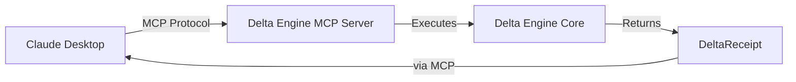

# @uvrn/mcp

**MCP Server for UVRN Delta Engine - AI-Native Bundle Processing**

[](https://www.npmjs.com/package/@uvrn/mcp)
[](https://opensource.org/licenses/MIT)

**Disclaimer:** UVRN is in Alpha testing. The engine measures whether your sources agree with each other — not whether they’re correct. Final trust of output rests with the user. Use at your own risk. Have fun.

*UVRN makes no claims to "truth", the "verification" is the output of math — it is up to any user to decide if claim is actually "true" — Research and testing are absolutely recommended per use case and individual system!!*

## Overview

The Delta Engine MCP server exposes UVRN's Delta Engine functionality to AI assistants through the [Model Context Protocol (MCP)](https://modelcontextprotocol.io/). This enables AI assistants like Claude Desktop to process bundles, validate data structures, and verify receipts without any adapter code.

### What is MCP?

**Model Context Protocol (MCP)** is an open standard for connecting AI assistants to external tools and data sources. Think of it as a universal "plugin system" for AI assistants.

### Why Use This Server?

- **AI-Native Integration**: Use Delta Engine directly from Claude Desktop or any MCP-compatible client
- **Zero Adapter Code**: No need to write custom integrations—just configure and go
- **Type-Safe Operations**: Full TypeScript type safety with comprehensive validation
- **Production Ready**: Battle-tested validation, error handling, and logging

## Features

### 🔧 Three MCP Tools

| Tool | Description |
|------|-------------|
| **`delta_run_engine`** | Execute Delta Engine on bundles to verify data consensus across sources |
| **`delta_validate_bundle`** | Validate bundle structure without executing (fast pre-flight check) |
| **`delta_verify_receipt`** | Verify receipt integrity by recomputing hashes |

### 📦 Four MCP Resources

| Resource URI | Description |
|--------------|-------------|
| `mcp://delta-engine/schema/bundle` | JSON schema for DeltaBundle structure |
| `mcp://delta-engine/schema/receipt` | JSON schema for DeltaReceipt structure |
| `mcp://delta-engine/receipts/{uvrn}` | Retrieve receipts by UVRN *(storage not yet implemented)* |
| `mcp://delta-engine/bundles/{id}` | Retrieve bundles by ID *(storage not yet implemented)* |

### 💡 Three MCP Prompts

| Prompt | Description |
|--------|-------------|
| **`verify_data`** | Template for data verification queries |
| **`create_bundle`** | Guided bundle creation with placeholder data |
| **`analyze_receipt`** | Receipt analysis and explanation template |

## Installation

### Global Installation (Recommended for CLI use)

```bash
npm install -g @uvrn/mcp
```

### Local Project Installation

```bash
npm install @uvrn/mcp
```

### Requirements

- Node.js >= 18.0.0
- npm >= 9.0.0

## Quick Start

### Claude Desktop Configuration

Add to your `claude_desktop_config.json`:

**macOS:** `~/Library/Application Support/Claude/claude_desktop_config.json`  
**Windows:** `%APPDATA%\Claude\claude_desktop_config.json`

```json
{
  "mcpServers": {
    "delta-engine": {
      "command": "npx",
      "args": ["-y", "@uvrn/mcp"]
    }
  }
}
```

**With environment variables:**

```json
{
  "mcpServers": {
    "delta-engine": {
      "command": "npx",
      "args": ["-y", "@uvrn/mcp"],
      "env": {
        "LOG_LEVEL": "info",
        "MAX_BUNDLE_SIZE": "10485760"
      }
    }
  }
}
```

Restart Claude Desktop, and the Delta Engine tools will be available!

### Running Standalone

```bash
# Global installation
uvrn-mcp

# Using npx
npx @uvrn/mcp

# Local installation
node node_modules/@uvrn/mcp/dist/index.js
```

## Tools Reference

### `delta_run_engine`

Execute the Delta Engine on a bundle to verify data consensus.

**Input:**
```json
{
  "bundle": {
    "bundleId": "test-bundle-001",
    "claim": "Product X has 10,000 sales",
    "dataSpecs": [
      {
        "id": "source-1",
        "label": "Internal CRM",
        "sourceKind": "report",
        "originDocIds": ["crm-2024-01"],
        "metrics": [
          { "key": "sales_count", "value": 10000 }
        ]
      },
      {
        "id": "source-2",
        "label": "Analytics Platform",
        "sourceKind": "metric",
        "originDocIds": ["analytics-dashboard"],
        "metrics": [
          { "key": "sales_count", "value": 9950 }
        ]
      }
    ],
    "thresholdPct": 0.05
  }
}
```

**Output:**
```json
{
  "receipt": {
    "bundleId": "test-bundle-001",
    "deltaFinal": 50,
    "outcome": "consensus",
    "rounds": [...],
    "hash": "sha256:abc123...",
    "ts": "2026-01-15T12:00:00Z"
  },
  "success": true
}
```

**Error Scenarios:**
- `VALIDATION_ERROR`: Bundle structure invalid or thresholdPct out of range
- `EXECUTION_ERROR`: Engine execution failed (check bundle data)

---

### `delta_validate_bundle`

Validate bundle structure without executing the engine.

**Input:**
```json
{
  "bundle": {
    "bundleId": "test-bundle-001",
    "claim": "...",
    "dataSpecs": [...],
    "thresholdPct": 0.05
  }
}
```

**Output (Success):**
```json
{
  "valid": true,
  "details": "Bundle \"test-bundle-001\" is valid with 2 data specs"
}
```

**Output (Failure):**
```json
{
  "valid": false,
  "error": "thresholdPct must be > 0 and <= 1",
  "details": "thresholdPct must be > 0 and <= 1"
}
```

---

### `delta_verify_receipt`

Verify receipt integrity by recomputing its hash.

**Input:**
```json
{
  "receipt": {
    "bundleId": "test-bundle-001",
    "deltaFinal": 50,
    "sources": ["source-1", "source-2"],
    "rounds": [...],
    "outcome": "consensus",
    "hash": "sha256:abc123...",
    "ts": "2026-01-15T12:00:00Z"
  }
}
```

**Output (Valid):**
```json
{
  "verified": true,
  "recomputedHash": "sha256:abc123...",
  "details": "Receipt for bundle \"test-bundle-001\" is valid. Hash verified: sha256:abc123..."
}
```

**Output (Invalid):**
```json
{
  "verified": false,
  "error": "Hash mismatch",
  "details": "Expected sha256:abc123..., got sha256:def456..."
}
```

## Resources Reference

### Schema Resources

**Get Bundle Schema:**
```
URI: mcp://delta-engine/schema/bundle
Returns: JSON Schema for DeltaBundle
```

**Get Receipt Schema:**
```
URI: mcp://delta-engine/schema/receipt
Returns: JSON Schema for DeltaReceipt
```

### Data Resources (Not Yet Implemented)

> [!NOTE]
> Receipt and bundle retrieval resources are declared but not functional in Phase A.3 (storage layer not implemented).

**Get Receipt by UVRN:**
```
URI: mcp://delta-engine/receipts/{uvrn}
Status: Planned for future phase
```

**Get Bundle by ID:**
```
URI: mcp://delta-engine/bundles/{id}
Status: Planned for future phase
```

## Prompts Reference

### `verify_data`

Template for data verification queries.

**Usage in Claude:**
```
Use the verify_data prompt to help me verify this claim: "..."
```

### `create_bundle`

Guided bundle creation with examples.

**Usage in Claude:**
```
Use the create_bundle prompt to help me create a bundle for verifying revenue data
```

### `analyze_receipt`

Receipt analysis and explanation.

**Usage in Claude:**
```
Use the analyze_receipt prompt to explain this receipt: {...}
```

## Configuration

See [ENVIRONMENT.md](./ENVIRONMENT.md) for detailed configuration options.

### Environment Variables

| Variable | Default | Description |
|----------|---------|-------------|
| `LOG_LEVEL` | `info` | Logging verbosity (`debug`, `info`, `warn`, `error`) |
| `MAX_BUNDLE_SIZE` | `10485760` | Maximum bundle size in bytes (10 MB) |
| `VERBOSE_ERRORS` | `false` | Include stack traces in error responses |
| `STORAGE_PATH` | (none) | Optional storage path (not yet implemented) |

**Example:**
```bash
LOG_LEVEL=debug MAX_BUNDLE_SIZE=20971520 npx @uvrn/mcp
```

## Use cases

- **Use the Delta Engine from an AI assistant** — Run bundles, validate, and verify receipts via MCP tools (e.g. Claude Desktop) without writing adapter code.
- **Expose schemas to agents** — Resources provide bundle and receipt JSON schemas so agents can construct valid payloads.
- **Guided prompts** — Use the built-in prompts (e.g. verify_data, create_bundle) to walk users through verification or bundle creation.

## Troubleshooting

### Server doesn't appear in Claude Desktop

1. Check your `claude_desktop_config.json` syntax (must be valid JSON)
2. Verify the file path is correct for your OS
3. Restart Claude Desktop completely
4. Check Claude Desktop logs for errors

**macOS Logs:**
```bash
tail -f ~/Library/Logs/Claude/mcp*.log
```

### Tool execution fails

**Check bundle validation first:**
```json
{
  "tool": "delta_validate_bundle",
  "arguments": {
    "bundle": { ...your bundle... }
  }
}
```

**Common issues:**
- `thresholdPct` must be > 0 and <= 1
- Need at least 2 data specs
- Each metric must have `key` and `value`

### Performance issues

**Reduce bundle size:**
- Limit number of data specs
- Reduce metrics per data spec
- Set lower `MAX_BUNDLE_SIZE`

**Enable debug logging:**
```bash
LOG_LEVEL=debug npx @uvrn/mcp
```

### Type errors in TypeScript projects

Ensure you're importing types correctly:

```typescript
import type { DeltaBundle, DeltaReceipt } from '@uvrn/mcp';
```

## Development

### Building from source

```bash
git clone https://github.com/UVRN-org/uvrn-packages.git
cd uvrn-packages/uvrn-mcp
pnpm install
pnpm run build
```

### Running Tests

```bash
npm test
```

### Local Development with Claude Desktop

```json
{
  "mcpServers": {
    "delta-engine-dev": {
      "command": "node",
      "args": ["/absolute/path/to/packages/uvrn-mcp/dist/index.js"],
      "env": {
        "LOG_LEVEL": "debug",
        "VERBOSE_ERRORS": "true"
      }
    }
  }
}
```

## Architecture

For detailed architecture information, see [MCP_INTEGRATION.md](../docs/MCP_INTEGRATION.md).



## Related Documentation

- [MCP Integration Guide](../../docs/MCP_INTEGRATION.md) - Detailed integration patterns
- [ENVIRONMENT.md](./ENVIRONMENT.md) - Configuration reference
- [CLAUDE_DESKTOP_SETUP.md](./CLAUDE_DESKTOP_SETUP.md) - Setup guide
- [Phase A.3 Task List](../../admin/docs/build-plans/phase_a3_task_list.md) - Implementation details

## License

MIT

## Links

**Open source:** Source code and issues: [GitHub (uvrn-packages)](https://github.com/UVRN-org/uvrn-packages). Project landing: [UVRN](https://github.com/UVRN-org/uvrn).

- [Repository](https://github.com/UVRN-org/uvrn-packages) — monorepo (this package: `uvrn-mcp`)
- [@uvrn/core](https://www.npmjs.com/package/@uvrn/core) — Delta Engine core
- [MCP Protocol](https://modelcontextprotocol.io/) — Model Context Protocol specification
