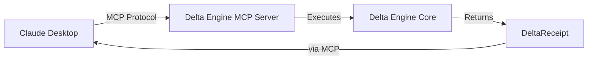

# @uvrn/mcp

**MCP Server for UVRN Delta Engine - AI-Native Bundle Processing**

[](https://www.npmjs.com/package/@uvrn/mcp)
[](https://opensource.org/licenses/MIT)

## Overview

The Delta Engine MCP server exposes UVRN's Delta Engine functionality to AI assistants through the [Model Context Protocol (MCP)](https://modelcontextprotocol.io/). This enables any stdio-compatible MCP client to process bundles, validate data structures, verify receipts, and call enriched drift/compare/identity helpers without custom adapter code.

**Package provides:** MCP server; tools (`delta_run_engine`, `delta_validate_bundle`, `delta_verify_receipt`, `delta_score_drift`, `delta_compare`, `delta_verify_identity`); resources (schemas); prompts. Uses UVRN protocol packages. No persistent storage for receipts/bundles in the base server.

**You provide:** MCP client configuration (e.g. Claude Desktop config) pointing at this server. If you need receipt/bundle storage, implement it externally or extend the server.

### What is MCP?

**Model Context Protocol (MCP)** is an open standard for connecting AI assistants to external tools and data sources. Think of it as a universal "plugin system" for AI assistants.

### Why Use This Server?

- **AI-Native Integration**: Use Delta Engine directly from Claude Desktop or any MCP-compatible client
- **Zero Adapter Code**: No need to write custom integrations—just configure and go
- **Type-Safe Operations**: Full TypeScript type safety with comprehensive validation
- **Production Ready**: Battle-tested validation, error handling, and logging

## Features

### 🔧 Nine MCP Tools

| Tool | Description |
|------|-------------|
| **`delta_run_engine`** | Execute Delta Engine on bundles to verify data consensus across sources |
| **`delta_validate_bundle`** | Validate bundle structure without executing (fast pre-flight check) |
| **`delta_verify_receipt`** | Verify receipt integrity by recomputing hashes |
| **`delta_score_drift`** | Score temporal drift for an already enriched `DriftInputReceipt` |
| **`delta_compare`** | Compare exactly two already scored receipts with `claimId` and `vScore` |
| **`delta_verify_identity`** | Look up signer reputation in an in-memory identity registry |
| **`delta_canon_qualify`** | Read-only canon candidacy assessment for a `DriftSnapshot` |
| **`delta_canon_get`** | Read a canon receipt by id from the configured `CanonStore` |
| **`delta_score_claim`** | Score a claim from host-provided sources, a configured connector, or mock data → verifiable `MasterReceipt` + `v_score` |

### 📦 Four MCP Resources

| Resource URI | Description |
|--------------|-------------|
| `mcp://delta-engine/schema/bundle` | JSON schema for DeltaBundle structure |
| `mcp://delta-engine/schema/receipt` | JSON schema for DeltaReceipt structure |
| `mcp://delta-engine/receipts/{uvrn}` | Retrieve receipts by UVRN *(storage not yet implemented)* |
| `mcp://delta-engine/bundles/{id}` | Retrieve bundles by ID *(storage not yet implemented)* |

### 💡 Three MCP Prompts

| Prompt | Description |
|--------|-------------|
| **`verify_data`** | Template for data verification queries |
| **`create_bundle`** | Guided bundle creation with placeholder data |
| **`analyze_receipt`** | Receipt analysis and explanation template |

## Installation

### Global Installation (Recommended for CLI use)

```bash
npm install -g @uvrn/mcp
```

### Local Project Installation

```bash
npm install @uvrn/mcp
```

### Requirements

- Node.js >= 18.0.0
- npm >= 9.0.0

## Quick Start

### Any stdio MCP client

Rebuild first when running from source so `dist/` reflects the current workspace:

```bash
pnpm --filter @uvrn/mcp run build
```

Then point any stdio MCP client at the built server:

```json
{
  "mcpServers": {
    "uvrn": {
      "command": "node",
      "args": ["/absolute/path/to/uvrn-mcp/dist/index.js"]
    }
  }
}
```

`@uvrn/core` and the peer packages used by enabled tools must resolve in the runtime environment.

### Plugin manifest

`plugin-manifest.json` describes the client-neutral stdio command, tools, resources, prompts, and runtime configuration contract. Agent hosts can read it to discover the UVRN capability set without assuming Claude Desktop, a specific OS, or a vendor integration.

### Claude Desktop Configuration

Add to your `claude_desktop_config.json`:

**macOS:** `~/Library/Application Support/Claude/claude_desktop_config.json`  
**Windows:** `%APPDATA%\Claude\claude_desktop_config.json`

```json
{
  "mcpServers": {
    "delta-engine": {
      "command": "npx",
      "args": ["-y", "@uvrn/mcp"]
    }
  }
}
```

**With environment variables:**

```json
{
  "mcpServers": {
    "delta-engine": {
      "command": "npx",
      "args": ["-y", "@uvrn/mcp"],
      "env": {
        "LOG_LEVEL": "info",
        "MAX_BUNDLE_SIZE": "10485760"
      }
    }
  }
}
```

Restart Claude Desktop, and the Delta Engine tools will be available!

### Running Standalone

```bash
# Global installation
uvrn-mcp

# Using npx
npx @uvrn/mcp

# Local installation
node node_modules/@uvrn/mcp/dist/index.js
```

## Tools Reference

### `delta_run_engine`

Execute the Delta Engine on a bundle to verify data consensus.

**Input:**
```json
{
  "bundle": {
    "bundleId": "test-bundle-001",
    "claim": "Product X has 10,000 sales",
    "dataSpecs": [
      {
        "id": "source-1",
        "label": "Internal CRM",
        "sourceKind": "report",
        "originDocIds": ["crm-2024-01"],
        "metrics": [
          { "key": "sales_count", "value": 10000 }
        ]
      },
      {
        "id": "source-2",
        "label": "Analytics Platform",
        "sourceKind": "metric",
        "originDocIds": ["analytics-dashboard"],
        "metrics": [
          { "key": "sales_count", "value": 9950 }
        ]
      }
    ],
    "thresholdPct": 0.05
  }
}
```

**Output:**
```json
{
  "receipt": {
    "bundleId": "test-bundle-001",
    "deltaFinal": 50,
    "outcome": "consensus",
    "rounds": [...],
    "hash": "sha256:abc123...",
    "ts": "2026-01-15T12:00:00Z"
  },
  "success": true
}
```

**Error Scenarios:**
- `VALIDATION_ERROR`: Bundle structure invalid or thresholdPct out of range
- `EXECUTION_ERROR`: Engine execution failed (check bundle data)

---

### `delta_validate_bundle`

Validate bundle structure without executing the engine.

**Input:**
```json
{
  "bundle": {
    "bundleId": "test-bundle-001",
    "claim": "...",
    "dataSpecs": [...],
    "thresholdPct": 0.05
  }
}
```

**Output (Success):**
```json
{
  "valid": true,
  "details": "Bundle \"test-bundle-001\" is valid with 2 data specs"
}
```

**Output (Failure):**
```json
{
  "valid": false,
  "error": "thresholdPct must be > 0 and <= 1",
  "details": "thresholdPct must be > 0 and <= 1"
}
```

---

### `delta_verify_receipt`

Verify receipt integrity by recomputing its hash.

**Input:**
```json
{
  "receipt": {
    "bundleId": "test-bundle-001",
    "deltaFinal": 50,
    "sources": ["source-1", "source-2"],
    "rounds": [...],
    "outcome": "consensus",
    "hash": "sha256:abc123...",
    "ts": "2026-01-15T12:00:00Z"
  }
}
```

**Output (Valid):**
```json
{
  "verified": true,
  "recomputedHash": "sha256:abc123...",
  "details": "Receipt for bundle \"test-bundle-001\" is valid. Hash verified: sha256:abc123..."
}
```

**Output (Invalid):**
```json
{
  "verified": false,
  "error": "Hash mismatch",
  "details": "Expected sha256:abc123..., got sha256:def456..."
}
```

---

### `delta_score_drift`

Score temporal drift for an already enriched `DriftInputReceipt`.

This tool does not build V-Score components from a raw `DeltaReceipt`. Callers must supply `v_score` and `components` produced upstream, such as by a scoring pipeline. A raw `DeltaReceipt` is rejected.

**Input:**
```json
{
  "receipt": {
    "receipt_id": "receipt-001",
    "issuer": "issuer-a",
    "timestamp": "2026-06-01T00:00:00.000Z",
    "v_score": 85,
    "components": {
      "completeness": 90,
      "parity": 80,
      "freshness": 70
    }
  },
  "profile": "default",
  "asOf": "2026-06-02T00:00:00.000Z"
}
```

**Output:**
```json
{
  "receipt": {
    "receipt_id": "receipt-001",
    "v_score": 85,
    "drift": {
      "decayed_score": 84.2,
      "status": "STABLE"
    }
  }
}
```

---

### `delta_compare`

Compare exactly two already scored claim receipts.

This tool does not enrich raw engine receipts. Each receipt must carry `claimId` or `claim_id` plus `vScore` or `v_score`. A raw `DeltaReceipt` is rejected because it does not contain those fields.

**Input:**
```json
{
  "receipts": [
    {
      "claimId": "claim-a",
      "vScore": 82,
      "status": "STABLE",
      "scoredAt": "2026-06-01T00:00:00.000Z"
    },
    {
      "claimId": "claim-b",
      "vScore": 74,
      "status": "DRIFTING",
      "scoredAt": "2026-06-01T00:00:00.000Z"
    }
  ],
  "options": {
    "normalize": false
  }
}
```

**Output:**
```json
{
  "result": {
    "winner": { "claimId": "claim-a", "vScore": 82 },
    "loser": { "claimId": "claim-b", "vScore": 74 },
    "delta": 8,
    "summary": "..."
  }
}
```

---

### `delta_verify_identity`

Look up signer reputation in an in-memory `MockIdentityStore`.

Phase 2 uses no external identity store and persists no state. Unknown addresses return `null`.

**Input:**
```json
{
  "address": "0xabc"
}
```

**Output:**
```json
{
  "reputation": null
}
```

---

### `delta_canon_qualify`

Assess whether a `DriftSnapshot` qualifies for canon suggestion. This is read-only and never calls `canonize`.

**Input:**
```json
{
  "claimId": "claim-a",
  "snapshot": {
    "receiptId": "receipt-a",
    "claimId": "claim-a",
    "scoredAt": "2026-06-05T00:00:00.000Z",
    "components": { "completeness": 90, "parity": 90, "freshness": 90 },
    "vScore": 90,
    "status": "STABLE"
  }
}
```

**Output:**
```json
{
  "result": {
    "qualifies": false,
    "reason": "Only 0/3 consecutive stable runs"
  }
}
```

---

### `delta_canon_get`

Read a canon receipt by id from the configured first `CanonStore` using `store.read(canonId)`.

**Input:**
```json
{
  "canonId": "canon_abc123"
}
```

**Output:**
```json
{
  "receipt": null
}
```

---

### `delta_score_claim`

Adapt a string claim into a `ClaimRegistration`, gather evidence, then run normalize → consensus → core engine → measurement modules and return a `MasterReceipt` plus a canonical `v_score` and provenance metadata.

**Evidence resolution — three paths, in precedence order:**

1. **Host-provided `sources`** — if the calling agent can search the web, it gathers **2 or more** sources and passes them in `sources`. This skips connector fetch entirely. Each source may carry an optional `evidenceScore` (0–100) and `credibility` (0–1).
2. **Configured `FarmConnector[]`** — if no host sources are given but connectors are configured, they are fetched.
3. **Mock** — with neither, MCP uses a deterministic in-process mock connector. It does not default to any named provider such as CoinGecko.

The path taken is reported back as `evidenceMode` (`host_sources` | `connector` | `mock`). Failed connectors are recorded in `masterReceipt.nodes[]` as `off` or `unavailable`; they are not silently dropped.

**Host-evidence rules (for agents supplying `sources`):**

- **`evidenceScore` is the measurement; `credibility` is the weight** — two distinct concepts. `evidenceScore` is *what* a source says about the claim (0–100); `credibility` is *how much* to trust that source (0–1).
- **`evidenceScore` is a first-class numeric field, not text.** Do not encode it into the `snippet`. The scorer reads the field directly, so a number elsewhere in the `title`/`snippet` (a year, "Top 10", a price) can never override it. If `evidenceScore` is omitted, the scorer falls back to the first number found in `title`/`snippet`.
- **At least 2 sources are required for host mode.** Exactly one source is a hard `ValidationError` — it does **not** fall back to a connector/mock. Omit `sources` (or pass `[]`) to use connectors/mock instead.
- **Bounds are enforced.** `evidenceScore` outside 0–100, `credibility` outside 0–1, or any non-finite value (`NaN`/`Infinity`) is rejected with a `ValidationError`.

**Input (host-provided sources):**
```json
{
  "claim": "Cottagecore prints are trending",
  "claimId": "cottagecore-prints",
  "label": "Cottagecore Prints",
  "sources": [
    { "url": "https://a.example.com", "title": "Trend report", "snippet": "Strong demand", "evidenceScore": 80, "credibility": 0.9, "publishedAt": "2026-06-01T00:00:00.000Z" },
    { "url": "https://b.example.com", "title": "Market movers", "snippet": "Cooling off",   "evidenceScore": 60, "credibility": 0.8, "publishedAt": "2026-06-04T00:00:00.000Z" }
  ]
}
```
`claimId` and `label` are optional. If `claimId` is omitted, a stable id is derived as a slug of the claim text plus a short hash (collision-resistant); pass an explicit `claimId` for stable cross-run comparison via `delta_compare`.

**Output:**
```json
{
  "masterReceipt": {
    "envelopeVersion": 1,
    "claim": "Cottagecore prints are trending",
    "base": { "hash": "..." },
    "measurements": [{ "type": "disagree", "verdict": "disagree" }],
    "nodes": [{ "id": "HostSources", "status": "on", "detail": "2 host sources" }],
    "masterHash": "..."
  },
  "v_score": 76,
  "claimId": "cottagecore-prints",
  "evidenceMode": "host_sources",
  "sourceCount": 2
}
```
`v_score` is the canonical V-Score. `sourceCount` is the number of sources **actually scored** — after non-numeric sources are dropped and near-identical sources (within 1% of each other and 1 day apart) are deduplicated — so it may be lower than the number of `sources` supplied.

## Resources Reference

### Schema Resources

**Get Bundle Schema:**
```
URI: mcp://delta-engine/schema/bundle
Returns: JSON Schema for DeltaBundle
```

**Get Receipt Schema:**
```
URI: mcp://delta-engine/schema/receipt
Returns: JSON Schema for DeltaReceipt
```

### Data Resources (Not Yet Implemented)

> [!NOTE]
> Receipt and bundle retrieval resources are declared but not functional in Phase A.3 (storage layer not implemented).

**Get Receipt by UVRN:**
```
URI: mcp://delta-engine/receipts/{uvrn}
Status: Planned for future phase
```

**Get Bundle by ID:**
```
URI: mcp://delta-engine/bundles/{id}
Status: Planned for future phase
```

## Prompts Reference

### `verify_data`

Template for data verification queries.

**Usage in Claude:**
```
Use the verify_data prompt to help me verify this claim: "..."
```

### `create_bundle`

Guided bundle creation with examples.

**Usage in Claude:**
```
Use the create_bundle prompt to help me create a bundle for verifying revenue data
```

### `analyze_receipt`

Receipt analysis and explanation.

**Usage in Claude:**
```
Use the analyze_receipt prompt to explain this receipt: {...}
```

## Configuration

See [ENVIRONMENT.md](./ENVIRONMENT.md) for detailed configuration options.

Runtime configuration is injected through `createServer(runtimeConfig?)`. Explicit startup arguments override environment-derived defaults. Omitted stateful capabilities use zero-external defaults only when a tool needs them.

Precedence:

1. Explicit `runtimeConfig` argument.
2. Environment variables loaded by `loadConfig()`.
3. Built-in zero-external defaults.

Default matrix:

| Capability | Default |
|------------|---------|
| Canon stores | Lazy `[new MockStore()]` from `@uvrn/canon` when canon tools run |
| Canon signer | Lazy `new MockSigner()` from `@uvrn/canon` when a signer is needed |
| Identity store | Lazy `new MockIdentityStore()` from `@uvrn/identity` when identity tools run |
| Connectors | `[]`; no provider such as `CoinGeckoFarm` is hardcoded |

Programmatic example:

```typescript
import { createServer } from '@uvrn/mcp';

const server = createServer({
  logLevel: 'info',
  connectors: [],
  canonStores: [myCanonStore],
  canonSigner: myCanonSigner,
  identityStore: myIdentityStore,
});
```

### Environment Variables

| Variable | Default | Description |
|----------|---------|-------------|
| `LOG_LEVEL` | `info` | Logging verbosity (`debug`, `info`, `warn`, `error`) |
| `MAX_BUNDLE_SIZE` | `10485760` | Maximum bundle size in bytes (10 MB) |
| `VERBOSE_ERRORS` | `false` | Include stack traces in error responses |
| `STORAGE_PATH` | (none) | Optional storage path (not yet implemented) |

**Example:**
```bash
LOG_LEVEL=debug MAX_BUNDLE_SIZE=20971520 npx @uvrn/mcp
```

## Use cases

- **Use the Delta Engine from an AI assistant** — Run bundles, validate, and verify receipts via MCP tools (e.g. Claude Desktop) without writing adapter code.
- **Expose schemas to agents** — Resources provide bundle and receipt JSON schemas so agents can construct valid payloads.
- **Guided prompts** — Use the built-in prompts (e.g. verify_data, create_bundle) to walk users through verification or bundle creation.

## Troubleshooting

### Server doesn't appear in Claude Desktop

1. Check your `claude_desktop_config.json` syntax (must be valid JSON)
2. Verify the file path is correct for your OS
3. Restart Claude Desktop completely
4. Check Claude Desktop logs for errors

**macOS Logs:**
```bash
tail -f ~/Library/Logs/Claude/mcp*.log
```

### Tool execution fails

**Check bundle validation first:**
```json
{
  "tool": "delta_validate_bundle",
  "arguments": {
    "bundle": { ...your bundle... }
  }
}
```

**Common issues:**
- `thresholdPct` must be > 0 and <= 1
- Need at least 2 data specs
- Each metric must have `key` and `value`

### Performance issues

**Reduce bundle size:**
- Limit number of data specs
- Reduce metrics per data spec
- Set lower `MAX_BUNDLE_SIZE`

**Enable debug logging:**
```bash
LOG_LEVEL=debug npx @uvrn/mcp
```

### Type errors in TypeScript projects

Ensure you're importing types correctly:

```typescript
import type { DeltaBundle, DeltaReceipt } from '@uvrn/mcp';
```

## Development

### Building from source

```bash
git clone https://github.com/UVRN-org/uvrn-packages.git
cd uvrn-packages/uvrn-mcp
pnpm install
pnpm run build
```

### Running Tests

```bash
npm test
```

### Local Development with Claude Desktop

```json
{
  "mcpServers": {
    "delta-engine-dev": {
      "command": "node",
      "args": ["/absolute/path/to/packages/uvrn-mcp/dist/index.js"],
      "env": {
        "LOG_LEVEL": "debug",
        "VERBOSE_ERRORS": "true"
      }
    }
  }
}
```

## Architecture

For detailed architecture information, see [MCP_INTEGRATION.md](../docs/MCP_INTEGRATION.md).


```mermaid
graph LR
    A[Claude Desktop] -->|MCP Protocol| B[Delta Engine MCP Server]
    B -->|Executes| C[Delta Engine Core]
    C -->|Returns| D[DeltaReceipt]
    D -->|via MCP| A
```

## Related Documentation

- [MCP Integration Guide](../../docs/MCP_INTEGRATION.md) - Detailed integration patterns
- [ENVIRONMENT.md](./ENVIRONMENT.md) - Configuration reference
- [CONNECT.md](./CONNECT.md) - Connect any MCP client (Claude Desktop, Claude Code, Hermes, Odysseus)
- [Phase A.3 Task List](../../admin/docs/build-plans/phase_a3_task_list.md) - Implementation details

## License

MIT

## Links

**Open source:** Source code and issues: [GitHub (uvrn-packages)](https://github.com/UVRN-org/uvrn-packages). Project landing: [UVRN](https://github.com/UVRN-org/uvrn).

- [Repository](https://github.com/UVRN-org/uvrn-packages) — monorepo (this package: `uvrn-mcp`)
- [@uvrn/core](https://www.npmjs.com/package/@uvrn/core) — Delta Engine core
- [MCP Protocol](https://modelcontextprotocol.io/) — Model Context Protocol specification
